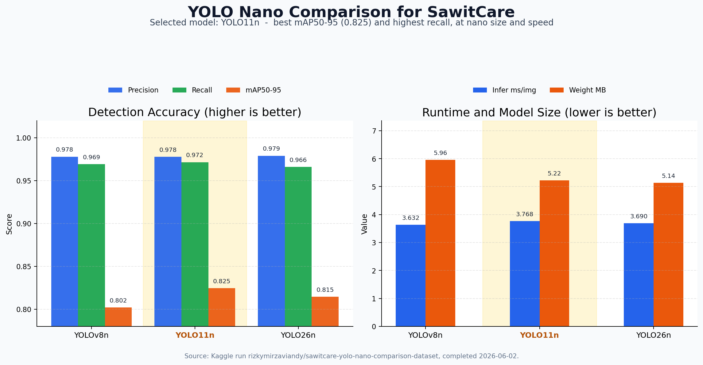

# SawitCare

SawitCare is the machine learning pipeline for early screening of oil palm trees in drone images and videos. It detects individual oil palm tree crowns, crops each detected tree, then classifies each crop as `healthy` or `suspicious`.

This repository contains only the ML part. It does not include the full application UI.

## Model architecture

- Main detector: YOLO11n
- Baseline/comparison detectors: YOLOv8n and YOLO26
- Classifier: EfficientNet B0
- Detection class: `oil_palm_tree`
- Health classes: `healthy`, `suspicious`

The word `suspicious` is used intentionally. SawitCare is for early screening and field-prioritization, not final disease diagnosis.

## Repository layout

```text
sawitcare-ml/
  configs/                  # YOLO and classifier configs
  data/raw/                 # Original datasets
  data/processed/           # Split/clean training data
  examples/videos/          # Committed presentation/sample videos
  models/                   # Saved trained weights
  outputs/                  # Annotated media, crops, CSVs, metrics
  src/data/                 # Dataset cleaning and splitting scripts
  src/training/             # Detector and classifier training
  src/inference/            # Image/video inference pipeline
  src/evaluation/           # Evaluation scripts
  src/utils/                # Shared utilities
```

## Installation

```bash
cd sawitcare-ml
python -m venv .venv
source .venv/bin/activate
pip install -r requirements.txt
```

## Dataset setup

One setup helper is included:

```bash
python src/data/setup_datasets.py
```

This downloads and extracts the public Mendeley classification dataset automatically. The Roboflow detection dataset requires an API key for export downloads; set `ROBOFLOW_API_KEY` before rerunning the helper if you want it to download the detection dataset too.

### Detection dataset

Use **Oil Palm Tree Crown Detection from Aerial Image** for palm crown detection.

Put raw data under:

```text
data/raw/detection/
  images/
  labels/
```

All palm-related labels are merged into one YOLO class:

```text
0 oil_palm_tree
```

Clean labels:

```bash
python src/data/clean_detection_labels.py \
  --labels-dir data/raw/detection/labels \
  --output-labels-dir data/processed/detection/clean_labels
```

Split detection data into YOLO format:

```bash
python src/data/split_detection_data.py \
  --raw-dir data/raw/detection \
  --output-dir data/processed/detection
```

If downloading from Roboflow, set your API key first:

```bash
export ROBOFLOW_API_KEY=your_key_here
python src/data/setup_datasets.py --skip-classification
python src/data/split_detection_data.py --raw-dir data/raw/detection --output-dir data/processed/detection
```

Expected processed detection layout:

```text
data/processed/detection/
  images/train images/val images/test
  labels/train labels/val labels/test
```

### Classification dataset

Use **Oil Palm Tree Detection for Anomaly Identification**.

Raw labels are mapped as:

- `PalmSan` -> `healthy`
- `PalmAnom` -> `suspicious`

Put raw images under folders or filenames containing `PalmSan` and `PalmAnom`, then run:

```bash
python src/data/split_classification_data.py \
  --raw-dir data/raw/classification \
  --output-dir data/processed/classification
```

The splitter also supports the Mendeley/Roboflow TensorFlow export format with `_annotations.csv`; it crops annotated palms and maps `PalmSan` to `healthy` and `PalmAnom` to `suspicious`.

Expected processed classification layout:

```text
data/processed/classification/
  train/healthy train/suspicious
  val/healthy val/suspicious
  test/healthy test/suspicious
```

## Train detectors

Train the main YOLO11n detector:

```bash
python src/training/train_detector_yolo.py --model yolo11n.pt --data configs/detection_data.yaml --imgsz 640 --epochs 100 --batch 8 --device 0
```

Train the YOLOv8n baseline:

```bash
python src/training/train_detector_yolo.py --model yolov8n.pt --data configs/detection_data.yaml --imgsz 640 --epochs 100 --batch 8 --device 0
```

Train the YOLO26 comparison model:

```bash
python src/training/train_detector_yolo.py --model yolo26n.pt --data configs/detection_data.yaml --imgsz 640 --epochs 100 --batch 8 --device 0
```

Best weights are copied to `models/detector/`.

## Train classifier

Train EfficientNet B0:

```bash
python src/training/train_classifier.py --data data/processed/classification --epochs 50 --batch 32 --device cuda
```

The script uses ImageNet pretrained weights, trains the classifier head first, then fine-tunes the last layers. The best checkpoint by validation F1 is saved to:

```text
models/classifier/efficientnet_b0_best.pt
```

## Image inference

```bash
python src/inference/predict_image.py \
  --image samples/drone_001.jpg \
  --detector models/detector/yolo11n_best.pt \
  --classifier models/classifier/efficientnet_b0_best.pt
```

Outputs:

- Annotated image: `outputs/images/`
- Prediction CSV: `outputs/predictions/`

CSV columns:

```text
image_name, tree_id, x1, y1, x2, y2, detector_confidence, health_label, classifier_confidence
```

## Video inference

```bash
python src/inference/predict_video.py \
  --video examples/videos/road_rainforest_oil_palm_indonesia.mp4 \
  --detector models/detector/yolo11n_best.pt \
  --classifier models/classifier/efficientnet_b0_best.pt \
  --frame_step 15
```

Outputs:

- Annotated video: `outputs/videos/`
- Frame-level CSV summary: `outputs/predictions/`

Committed example video:

- `examples/videos/road_rainforest_oil_palm_indonesia.mp4`
- Source filename: `Aerial view of a road separating rainforest from an oil palm plantation in Indonesia.mp4`
- Format: H.264, 1920x1080, 27.4 seconds

## Presentation demo

For a cleaner presentation command, use the demo wrapper:

```bash
python demo_sawitcare.py --video examples/videos/road_rainforest_oil_palm_indonesia.mp4
```

The wrapper runs the recommended demo settings:

- tiled YOLO11n inference for 1080p video
- compact `H`, `S`, and `U` labels
- top-left summary box
- full confidence values saved in CSV, not shown on the video

CSV columns:

```text
frame_id, total_trees, healthy, suspicious, suspicious_ratio
```

## Evaluation

Detector test metrics:

```bash
python src/evaluation/eval_detector.py --model models/detector/yolo11n_best.pt --data configs/detection_data.yaml
```

Detector comparison across YOLOv8n, YOLO11n, and YOLO26:

```bash
python src/evaluation/compare_detectors.py --train-missing --data configs/detection_data.yaml --imgsz 640 --epochs 50 --batch 8 --device 0
```

If all checkpoints already exist under `models/detector/`, omit `--train-missing` to only evaluate them. The comparison writes JSON, CSV, and Markdown tables under `outputs/metrics/`.

Create presentation charts from the saved comparison metrics:

```bash
python src/evaluation/plot_detector_comparison.py
```

The generated chart is committed for presentation use:



Kaggle GPU run through the Kaggle CLI:

```bash
python -m pip install kaggle
kaggle kernels push -p kaggle
```

The Kaggle kernel script uses private Kaggle datasets for the Roboflow export, offline YOLO weights, and offline Python wheels. It trains `yolov8n` and YOLO26 from `yolo26n.pt`, evaluates the existing `yolo11n_best.pt` checkpoint, and writes comparison outputs under `/kaggle/working/sawitcare/outputs/metrics/`.

Kaggle example-video inference through the Kaggle CLI:

```bash
kaggle datasets create -p kaggle_datasets/sawitcare-video-inference-assets
kaggle kernels push -p kaggle/video_inference
kaggle kernels status rizkymirzaviandy/sawitcare-example-video-inference
kaggle kernels output rizkymirzaviandy/sawitcare-example-video-inference -p kaggle_outputs/video_inference
```

If the private dataset already exists, replace the first command with:

```bash
kaggle datasets version -p kaggle_datasets/sawitcare-video-inference-assets -m "Update SawitCare video inference assets"
```

The video inference kernel runs the first 300 frames of `examples/videos/road_rainforest_oil_palm_indonesia.mp4` with `yolo11n_best.pt` and `efficientnet_b0_best.pt`, then saves an annotated MP4 and CSV predictions under `/kaggle/working/sawitcare/outputs/`. Set the `MAX_FRAMES` environment variable in the script environment to change the preview length or run the full video.

Latest nano detector comparison:

| Model | Mode | Precision | Recall | mAP50 | mAP50-95 | Infer ms/img | Weight MB |
|---|---|---:|---:|---:|---:|---:|---:|
| YOLOv8n | trained on Kaggle | 0.9780 | 0.9693 | 0.9901 | 0.8021 | 3.632 | 5.96 |
| YOLO11n | existing checkpoint | 0.9779 | 0.9716 | 0.9899 | 0.8245 | 3.768 | 5.22 |
| YOLO26n | trained on Kaggle | 0.9791 | 0.9662 | 0.9900 | 0.8146 | 3.690 | 5.14 |

YOLO11n remains the best overall detector on this comparison because it has the highest recall and mAP50-95. YOLO26n has the highest precision.

Classifier test metrics:

```bash
python src/evaluation/eval_classifier.py --model models/classifier/efficientnet_b0_best.pt --data data/processed/classification
```

Pipeline sample evaluation:

```bash
python src/evaluation/eval_pipeline_samples.py \
  --samples samples \
  --detector models/detector/yolo11n_best.pt \
  --classifier models/classifier/efficientnet_b0_best.pt
```

Metrics are saved under `outputs/metrics/`.

## Expected outputs

- `outputs/images/`: annotated images with tree boxes and health labels
- `outputs/videos/`: annotated videos
- `outputs/crops/`: cropped tree images from sample pipeline runs
- `outputs/predictions/`: CSV prediction results
- `outputs/metrics/`: detector, classifier, and pipeline metrics

## Limitations

- The model does not diagnose exact disease.
- The `suspicious` label means the tree needs field inspection.
- Drone altitude, lighting, camera quality, season, and dataset quality can affect performance.
- The detector and classifier datasets may come from different sources, so final pipeline results need manual review.
- This first version is intended as a simple working baseline before broader app integration.
